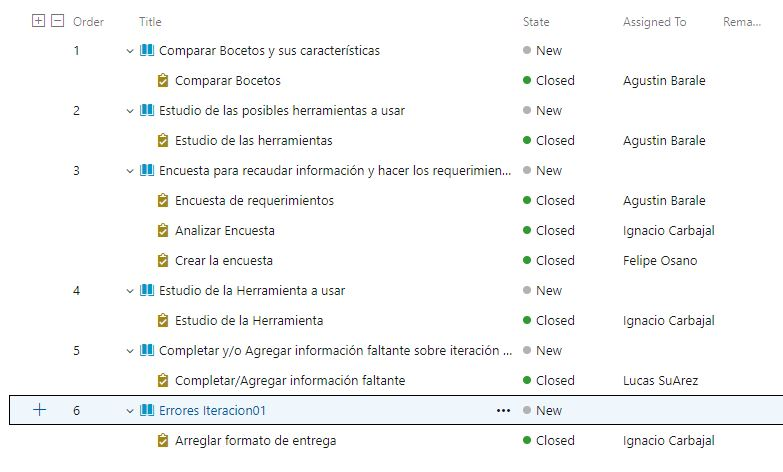
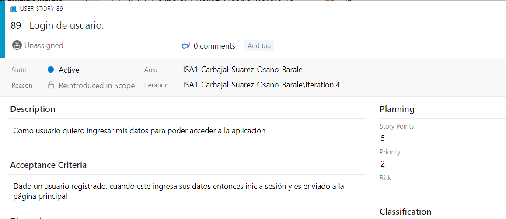
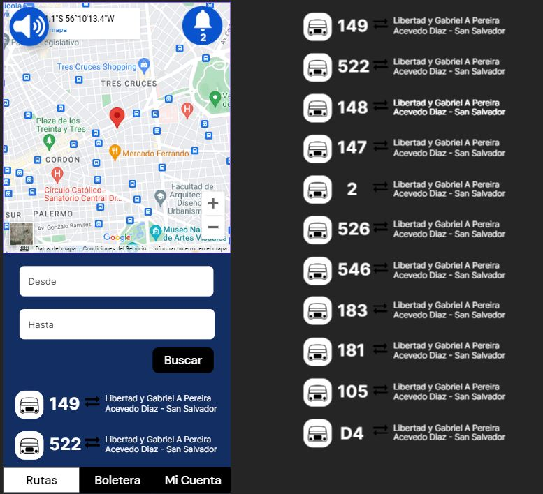
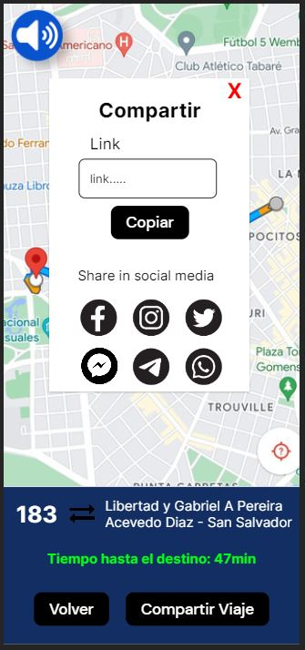
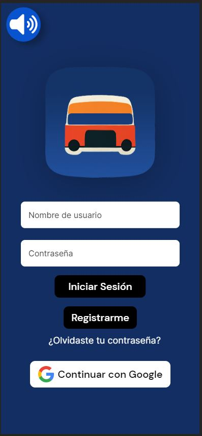
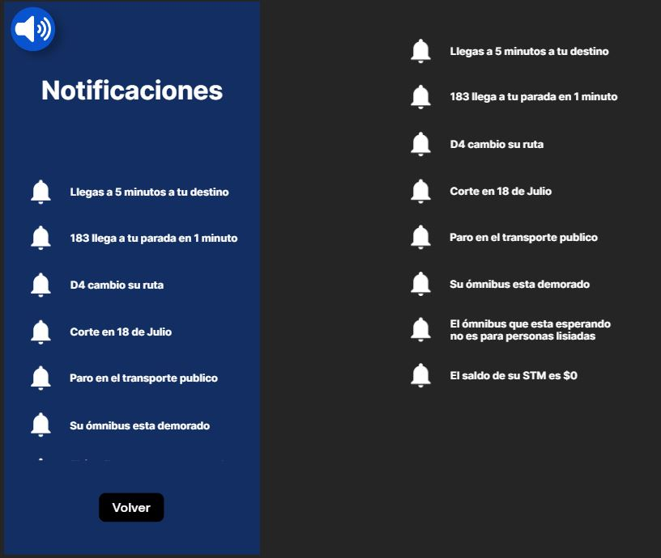

# Carbajal-Suarez-Osano-Barale

* Repositorio dedicado al obligatorio de Ingeniería de Software Ágil 1.

# Indice
1. [Definición del Marco de Trabajo.](#id1)
2. [Planificacion de las Iteraciones.](#id2)
3. [ Inspeccion y adaptacion del proceso](#id3)
4. [Seguimiento de las Iteraciones](#id4)
5. [Repositorio del proyecto](#id5)
6. [Definicion del problema solucion](#id6)
7. [Encuesta para Requerimientos](#id7)
8. [Identificación del problema a resolver](#id8)
9. [Prototipos con posibles Soluciones](#id9)
10. [Ispeccion y Adaptacion del Producto](#id10)
11. [Informe academico](#id11)
12. [Link de la Demo](#id12)

# Definición del Marco de Trabajo 

## Scrum

Definimos usar Scrum por ser un buen marco de trabajo colaborativo entre equipos.

Scrum nos permite priorizar los módulos que aportan mayor valor al negocio y a la organización de una manera iterativa, recibiendo constantemente una retroalimentación de parte del equipo y del product owner.

Este marco de trabajo nos permite organizarnos de una mejor forma utilizando iteraciones a lo largo del proyecto las cuales tienen una duración de 2 semanas. Esto permite al equipo enfocarse durante la iteración en las tareas definidas en la misma.

Scrum nos permite trabajar de una forma mas unida y organizada generando retroalimentación de una manera constante al realizar reuniones diarias entre los miembros del equipo y reuniones con el product owner obteniendo un feedback sobre el trabajo realizado.

## Sprint planning
 
Al comienzo de cada sprint definimos qué tareas hacer para la iteración.
 
Estas tareas fueron discutidas una vez que estuvo bien definido el backlog.
 
El Scrum master (Lucas) es el encargado de organizar las sesión (de aproximadamente una hora) y en ella debe estar presente todo el equipo de Scrum, Scrum master, Product Owner (Ignacio) y los developers (Agustin y Felipe).
En esta sesión vamos a planificar que es lo que vamos a hacer durante el sprint y cómo lo vamos a hacer.
 
 
## Daily Scrum
 
Esta es una reunión diaria del equipo que se usa en este marco de trabajo.
 
Por diferencia de horario y por no tener avances todos los días decidimos estar comunicados por mensajes y juntarnos cuando sea necesario.
 
Durante el daily scrum, cada miembro del equipo responde las siguientes 3 preguntas:
 
* ¿Qué hiciste ayer?
* ¿Qué harás hoy?
* ¿Hay impedimentos tuvimos?
 
Al enfocarse en lo que cada miembro del equipo hizo ayer y hará hoy, el equipo gana una visión general de lo que se ha realizado y aquello que falta por realizar.
 
## Sprint Review
 
El Sprint Review es la reunión que ocurre al final del Sprint, generalmente el último viernes del Sprint, donde el product owner y el Develpment Team presentan a los stakeholders el incremento terminado para su inspección y adaptación correspondientes. En esta reunión organizada por el product owner se estudia cuál es la situación y se actualiza el Product Backlog con las nuevas condiciones que puedan afectar al negocio.
 
Al finalizar cada sprint vamos a realizar esta reunión para identificar aspectos positivos y negativos sobre el trabajo realizado. En este tipo de reunión se estudia cual es la situación junto al product owner y en base a eso se actualiza el product backlog con las nuevas condiciones.
 
 
##  Sprint Retrospectiva
 
Esta reunión se hace después del Sprint Review y el objetivo es reflexionar sobre el último sprint e identificar posibles mejores para el próximo.
 
La retrospectiva ocurre al final del Sprint, justo después del Sprint Review. En algunos casos y por comodidad de los equipos, se realiza conjuntamente con el Sprint Planning, siendo la retrospectiva la parte inicial de la reunión.
 
El objetivo de la retrospectiva es hacer de reflexión sobre el último Sprint e identificar posibles mejoras para el próximo. Aunque lo habitual es que el Scrum Master sea el facilitador, es normal que distintos miembros del equipo Scrum vayan rotando el rol de facilitador durante la retrospectiva.
 
Un formato común es analizar qué ha ido bien durante el Sprint, qué ha fallado y qué se puede mejorar. Este formato se puede facilitar pidiendo a los miembros del equipo Scrum que escriban notas –en post-its- para luego agruparlas y votar aquellos ítems más relevantes, dando la oportunidad a todos de hablar y expresar sus inquietudes.

## Roles

### Scrum Master

Lucas Suarez.

Por su experiencia como profesor particular de matemáticas, Lucas tiene la habilidad de comunicarse y explicarse de forma correcta pudiendo así llevar a cabo la capacitación a los miembros del equipo.

Es una persona organizada, por ende, puede llevar a cabo las reuniones rápidas diarias, preguntando a cada uno cuando disponen del tiempo para hacerlas y buscar el mejor momento para ellas.

Es proactivo, lo cual es necesario para eliminar todos los posibles obstáculos que los Developers y el producto owner tangan.

### Product Owner

Ignacio Carbajal.

Por la simpleza y facilidad para explicarse, la forma en que escuchar e interpretar lo que otros dicen, hacen que Ignacio pueda desempeñar este rol de forma correcta ya que se necesita de alguien que escuche las ideas del cliente y se las traspase al equipo de trabajo.

Es organizado y meticuloso, por lo que tendrá facilidad para organizar las tareas del producto backlog con la prioridad que merezcan. Además de poder gestionar todo el tiempo de vida del producto, supervisando paso por paso para que todo salga de la mejor manera posible y como lo definido en el backlog.

### Development Team

Agustin Barale y Felipe Osano.

Se tomó la decisión de elegir a Felipe y Agustín como los Developers del equipo debido a la experiencia que ambos manejan ya que trabajan en el área del desarrollo de Software.

Son creativos, algo necesario para poder plasmar lo que el producto backlog exige.

Saben trabajar en equipo, se adaptan a los cambios y gestionan bien el tiempo.

## Adaptaciones principales al marco SCRUM

* Una de las principales adaptaciones es el tema de las reuniones o Dailys, Scrum recomienda que dichas Dailys se realicen todos los días con una duración de 15 minutos cada una.

Al no tener el tiempo necesario para aplicar al pie de la letra lo que nos recomienda Scrum, vamos a realizar las Dailys por medio de mensajes a través de wpp o el canal de team. A su vez, cuando se pueda y todos los participantes estén disponibles, haremos una puesta a punto a través de una videollamada. 

* Scrum recomienda que el equipo tenga en total 5 integrantes con roles bien definidos, en este caso al ser un equipo de 4 personas, adaptamos el marco de manera que todos los integrantes cumplamos la función de programadores (Development Team)

* La metodología Scrum recomienda trabajos presenciales, pero debido a la disponibilidad horaria del equipo y el lugar de residencia de cada uno, esto se hizo imposible, por lo que optamos por hacer las reuniones en formato 100% virtual. 

* Adaptamos las retros a una 1 hora como máximo por lo comentado en puntos anteriores, la disponibilidad horaria de los integrantes del equipo era muy acotada.

## Definition of Ready

Identificación del problema a resolver:

* A quien está orientado nuestro producto

* Que desea cada uno de ellos

* Saber cuales son nuestros competidores y en qué área estamos compitiendo

Definición del problema solución:

* Conocer el producto

Encuesta para Requerimientos:

* Tener definido nuestros consumidores

* La forma en la que se ejecutara la encuesta (presencial, Google forms, etc)

* Si es viable la encuesta para recaudar la información que necesitamos

## Definition of Done

Identificación del problema a resolver:

* Si es viable la encuesta para recaudar la información que necesitamos

* Reconocer de forma correcta a que consumidores estamos apuntando.

* Filtrar la lista de funcionalidades de forma que queden priorizadas, si alguna de las tareas del sprint backlog no llego a realizarse, que la misma vuelva al producto backlog y se tenga en cuenta para el siguiente sprint.

Definición del problema solución:

* Cuando todo el equipo entendió de forma correcta lo que se tenia que hacer, siguiendo se había acordado por el producto owner y el scrum master, dentro del producto backlog
  
Atribuos de Calidad

* Para poder escalar a la mayor cantidad de usuarios posibles, nuestra solución sería colocar la aplicación en las plataformas de descargas digitales más conocidas por todos (appStore y GooglePlay).

* Para que nuestra aplicación pueda ser utilizada por las distintas franjas etarias de la población, decidimos utilizar un diseño con botones y textos grandes para que las personas con dificultades visuales puedan utilizarse sin inconvenientes.

* Para las personas con discapacidades visuales, nuestra aplicación contará con un botón cuya función sería que mediante un comando de voz te vaya guiando con las distintas capas de nuestra aplicación.

* Para poder esconder los datos sensibles, contamos con un inicio de sesión cuya funcionalidad sería poner una capa de seguridad para acceder a dichos datos.

## Encuesta para Requerimientos:

* Cuando se alcanzó a una cantidad esperada de encuestados

* Se recaudo la suficiente información para poder analizar las respuestas

# Planificacion de las Iteraciones 
## Objeto Principal de cada Iteracion

### Iteracion 1

Para esta iteración no se pensó en un sprint backlog pensando en el cliente, sino en nosotros. Con esto me refiero que entendimos bien como funciona y se implementa la metodología ágil Scrum, creamos el repositorio en el cual vamos a trabajar, con sus respectivas estrategias de branching, etc.

Sumando esto se pensó bien el product backlog, el armado del story map con sus respectivas conclusiones al respecto.

### Iteracion 2 

* Arreglar bugs o errores de la Iteracion 1
* Creacion de prototipos
* Estimar la velocidad del equipo en cada tarea
  
### Iteracion 3 

En esta iteración vamos a seguir con los prototipos interactivos para el cliente, además de analizar el feedback de cada uno y llevar a cabo los cambios necesarios.
En esta iteración vamos a cambiar y mejorar errores de la iteración 2.

## Sprint Backlog

### Iteracion 01

Para esta iteración no se pensó en un sprint backlog pensando en el cliente, sino en nosotros. Con esto me refiero que entendimos bien como funciona y se implementa la metodología ágil Scrum, creamos el repositorio en el cual vamos a trabajar, con sus respectivas estrategias de branching, etc.

Sumando esto se pensó bien el product backlog, el armado del story map con sus respectivas conclusiones al respecto.

### Iteracion 02

### Iteracion 03

## Story Map

Para ver el story maps de cada iteracion de forma detalla, ingresar a la carpeta "EvidenciaDocumentacion/StoryMap" 

### Conclusiones Story Map (Objetivo de cada Iteracion)

#### Iteracion 02

* Estudio de las herramientas a usar para prototipar, marcar las horas y cualquier otra cosa que necesitemos para realizar el obligatorio.
  
* Encuestas para recaudar información.
  
* Comparar bocetos hechos a mano con la información obtenida de las encuestas y analizar características para así después hacer los prototipos en Frammer.
  
* Crear ciertos prototipos que vamos a elegir juntos con los Developers, dejando así los otros para la siguiente iteración.

#### Iteración 03

* Como en la iteración pasada ya realizamos algunos prototipos y se entendió el uso de la herramienta, en esta iteración el principal objetivo es terminar de prototipar todas las funcionalidades pedidas.

* Otro de los objetivos, es ir corrigiendo los errores marcados en la iteración anterior.

#### Iteración 04

* Para esta iteración el objetivo principal es realizar el video demostrativo de la aplicación. Mostrando en el mismo todos los prototipos realizados.

* Además del video, se realizará un informe académico, detallando lo aprendido a lo largo del todo el proyecto. Agregando en el mismo las conclusiones de cada miembro del equipo.

* Como en todas las iteraciones pasadas, se arreglan los errores cometidos en iteraciones anteriores.

## Calculo de la velocidad del equipo

### Iteracion 01

Al no tener definido un sprint planning, para esta iteración no se realizó el cálculo de la velocidad del equipo.

### Iteracion 02

**Nomenclatura :** Stoty point (id de la user story)

1) **Total de puntos completados** = 3(133)+3(140)+3(132)+5(144)+3(134)+5(89)+93(3)+3(141) = 28

2) **Total de jornadas reales:**

    (Son 4 iteraciones de 2 semanas cada una: 14 dias)

    **Jornadas Ideales** = 14 +14 + 14 + 14 = 56 

    **Jornadas Reales** = 10 + 10 + 8 +8 = 36

    **Jornadas Peor Caso** = 1 + 1 + 1 + 1 = 4

3) **Calculo de la Velocidad**
   
   * La velocidad es la división de los puntos completados y de las jornadas reales
* 

    V = 28 / 36 → V = 0,7 = 70% 

| Iteración | Velocidad |
| --------- | -------- |
| 1         |   -      |
| 2         | 70%      |

### Iteracion 03

**Nomenclatura :** Stoty point (id de la user story)

1) **Total de puntos completados** = 3(90) + 3(91) +3(92) + 3(93) + 8(94) + 3(95) + 5(96) + 5(97) + 8(99) + 5(146) + 5(158) = 51

2) **Total de jornadas reales:**

    (Son 4 iteraciones de 2 semanas cada una: 14 dias)

    **Jornadas Ideales** = 14 +14 + 14 + 14 = 56 

    **Jornadas Reales** = 12 + 12 + 10 + 10 = 44 

    **Jornadas Peor Caso** = 1 + 1 + 1 + 1 = 4

3) **Calculo de la Velocidad**
   
   * La velocidad es la división de los puntos completados y de las jornadas reales
* 

    V = 51 / 44 → V = 1,15 = 115 % 

   | Iteración | Velocidad |
| --------- | -------- |
| 1         |   -      |
| 2         | 70%      | 
| 3         | 115%     |

Si bien mejoramos la Velocidad en tanto adaptamos el proceso, entendemos que esta métrica no es fiel a la realidad, siendo que en la adaptación del proceso reestimamos las historias de usuario con el criterio de Fibonacci. Por tanto, las historias de usuario pertenecientes a la iteración 2 fueron realizadas con distinto criterio al nuevo.

### Iteracion 04

**Nomenclatura :** Stoty point (id de la user story)

1) **Total de puntos completados** = 

2) **Total de jornadas reales:**

    (Son 4 iteraciones de 2 semanas cada una: 14 dias)

    

3) **Calculo de la Velocidad**
   
   * La velocidad es la división de los puntos completados y de las jornadas reales
* 

    V = 

   | Iteración | Velocidad |
| --------- | -------- |
| 1         |   -      |
| 2         | 70%      | 
| 3         | 115%     |
| 4         |          |

*agregar comentario*

#  Inspeccion y adaptacion del proceso 

## Retrospectiva

###  Iteracion 1

* No marcamos las horas trabajadas de cada integrante para cada tarea, solo marcamos quien las realizo y cuando se fnalizaron. Sabemos que es una mala practica pero sera implementado para la siguiente iteracion.

* Debemos de organizar mejor los tiempos de trabajo, ya que para que esta entrega tuvimos que dejar cosas sin hacer por falta de tiempo.

* No cumplimos con las reuniones necesarias.

* No mostramos de forma correcta el desarrollo del Product Blacklog ni del Sprint Backlog.

### Iteracion 2 

#### Action Item de la Iteracion 02

#### Medicion Acions Item de la Iteracion 02

1- Pudimos organizar mejor el trabajo, realizando sesiones personales donde cada uno trabaja en sus task asignadas y luego las discutimos en conjunto en las dailys.

2- Recurrimos a grabaciones de clases anteriores para resolver dudas, si no podíamos con eso recién ahí buscábamos en internet.

3- Hicimos un google calendar todos juntos con los horarios de los integrantes del equipo para poder organizar mejor las sesiones.

4-  Todos pusimos recordatorios en nuestros celulares para marcar las horas de trabajo.

### Iteracion 3

#### Actions Item de la Iteracion 03

* Utilizar más el grupo de Teams con la profesora por cualquier inquietud o duda que tengamos.

* Concurrir más a las ayudantías.

* Tratar de juntarnos los 4 miembros del equipo todos los días, aunque sea poco tiempo. 

#### Medicion Acions Item de la Iteracion 03  

1- Como se marcó en los actions Ítem de la iteración 03, una de las mejores era el uso del canal de Teams para verificar información y tratar de minimizar los errores a cometer, tanto de la parte de documentación como en la parte de realización de prototipos.

Esto se cumplió como se esperaba, ya que a la mínima duda o inconveniente que surge, nos comunicamos inmediatamente con los docentes a través del canal de comunicación referido anteriormente.

2- Con el tema de la ayudantías  no se cumplió como se esperaba, preferimos priorizar el punto anterior antes que las ayudantías. Esta fue una eleccion del equipo.

3- Al igual que el punto anterior, nuestra intención era juntarnos de manera presencial 1 vez por semana. Esto no fue una buena elección de mejora, ya que por tema de tiempos y distancias nos resultó casi imposible coordinar horario y lugar de encuentro.

# Seguimiento de las Iteraciones 

## Daily Scrum

### Segunda Iteracion

#### Daily 1

*Lucas:* 

En los días previos a esta daily empecé con mi tarea asignada que fue agregar la información faltante de la iteración 1.
 
Como esta tarea era mejorar el formato o la justificación de algunos puntos, no tuve ningún inconveniente al realizar la misma.
 
Los días siguientes a esta daily voy a seguir con mi tarea asignada.

*Ignacio:*

En estos días estuve estudiando la herramienta a usar para hacer los prototipos, por lo que estuve buscando la mejor opción me parece Frammer, es gratis y tiene bastante información para investigar.
En estos días voy a ver como usar bien la herramienta así podemos empezar a usarla y hacer prototipos.
Estuve trancado en los primeros pasos con Frammer pero con ayuda del equipo lo pudimos sacar adelante.

*Agustin:*

Como mi tarea era comparar los bocetos realizados por mis compañeros, primero tuve que esperar a que ellos completaran dicha tarea. Una vez que esto ocurrió, elegí por el que más se adapta a lo pensado previamente.

Como esta no es una tarea que lleve mucho pienso, no tuve ninguna dificultad que me impidiera avanzar de manera correcta.

*Felipe:* 

En los días previos comencé a realizar la encuesta, organizar las preguntas a hacer y en donde y como hacerla. Tome la decisión de hacerlo en google forms porque es más sencillo de compartir y analizar los datos obtenidos.
En estos días voy a seguir con las preguntas para poder terminarla.
No me tranque en nada en esta tarea.

##### Daily 2

*Lucas:* 

Para esta segunda daily, como ya tenía todo encaminado, les mostré a mis compañeros los cambios realizados para obtener su aprobación.

Una vez obtenida, hice el correspondiente pull request.

*Ignacio:*

En estos días arregle el formato de la entrega con las correcciones que nos dio la profesora, que básicamente fue sacar el formato de carpetas y llevar todo a un readme. También termine de estudiar la herramienta Frammer.
Ahora estoy trancado ya que estoy esperando a que se recauden los suficientes datos en la encuesta para así poder analizarlos.
En estos días voy a estar analizando los datos de la encuesta para asi poder terminar con esa parte. 

*Agustin:*

Una vez realizado los bocetos con su respectivo análisis, se discutio en el grupo si eran los más adecuados para posteriormente hacer los prototipos.

*Felipe:* 

Como ya había terminado mis tareas lo que hice fue mostrar mis cambios y avances a mi compañeros para así tener su feedback.
Gracias a ese feedback cambie ciertas preguntas de la encuesta.

### Tercera Iteracion

#### Daily 1 

*Lucas:*

Estuve arreglando los probelmas de la iteracion pasada. Avnace con las tareas asignadas para dicha user story.

*Ignacio:*

Arregle los errores cometidos en la segunda iteracion, no tuve ningun incoveninte con dichas tareas. En los dias posteriores seguire con esto.

*Agustín:*

Hice parte de mis prototipos asignados, me comunique con Felipe para corroborar estilos de ciertas vistas de la app. En estos días tengo pensado seguir con esto. Estuve trancado con un prototipo pero ya resolví el conflicto.

*Felipe:*

Adelante con mis prototipos, ayude a Agustin con problemas que tuvo además estuve investigando sobre formas de hacer la app más inclusiva para personas ciegas. En estos días tengo pensado terminar con mis prototipos

#### Daily 2

*Lucas:*

Termine de hacer mi parte de las tareas de la correcion de errores.

*Ignacio:*

Termine de hacer las tareas asignadas para esta iteracion..

*Agustín y Felipe:*

Hicimos todos los prototipos pedidos.

## BurdownChart

### Iteracion 01

Al no tener un Product Backlog bien definido, es decir, con las story maps y las tareas en asigandas a cada historia, no se pudo realizar el BurdownChart esperado. 

### Iteracion 02

Al no tener un Product Backlog bien definido, es decir, con las story maps y las tareas en asigandas a cada historia, no se pudo realizar el BurdownChart esperado. 

### Iteracion03

#### Conclusiones

* Como se puede observar en el gráfico la asignación de historias con sus tareas para esta iteración fueron realizadas 3 días después del comienzo de dicha iteración.
 
* El gráfico muestra que no se realizó con todas las historias planificadas para esta iteración. Esto se ve reflejado en como la parte final del gráfico no desemboca en el eje de las x. Esto se da ya que dichas historias no completadas no fueron marcadas como "Closed" en el Azure Devops.

## Registro de Horas

Para que no sobrecargar esta documentacion, la evidencia del registro de horas de cada participante se encuentra en una caepta aparte. Esta se puede encontrar en la carepata llamada "EvidenciaDocumentacion" dentro de la sub carpeta "RegistroHoras".

En esta segunda iteracion tuvimos incovenientes en marcar las horas, por lo tanto van a aparecer tareas sin sus respectivas horas.

### Iteracion 02

| Persona             | Horas | Actividades Realizadas (Id de la task)|
| ------------------- | ----- |---------------------------------------|
| Lucas               | 3.16  | #50                                   |
| Ignacio             | 4.10  | #43, #49, #59                         |
| Felipe              | 3.21  | #40                                   |
| Agustin             | 1.52  | #39, #55, #57                         |

* Ignacio y Lucas al ser el Product Owner y el Scrum Master respectivamente, se encargaron de corregir los errores tanto en la parte de la documentación como en el uso  correcto de la metodología Scrum.

* Por otro lado Felipe y Agustín al ser los Development Team, estuvieron a cargo de realizar los bocetos y posteriores prototipos de la aplicación. 

### Iteracion 03

| Persona             | Horas | Actividades Realizadas (Id de la task)|
| ------------------- | ----- |---------------------------------------|
| Lucas               | 2:28  |  #149, #150, # 151                    |
| Ignacio             | 4:59  |  #147, #148, #166                     |
| Felipe              | 4.15  |  #116, #113, #119, #127, #162         |
| Agustin             | 3.48  |  #112, #118, #123, #160               |

Como se puede observar en la tabla mostrada, las tareas de cada integrante sigue siendo la misma con la diferencia que los desarrolladores tienen más horas de trabajo, esto se debe a que los prototipos en esta iteración fueron muchos más comparados a la iteración anterior.

Dentro de la carpeta EvidenciaDocumentacion/RegistroHoras/Iteracion03 pueden encontrar sub carpetas con el nombre de cada integrante del equipo. Dentro de dichas carpetas encontraran un PDF por cada integrante que el mismo contiene las horas marcadas con la herramienta Toggl y las horas marcadas en Azure Devops con sus respectivas estimaciones.
  
## Retros

#  Repositorio del proyecto 

Para que no sobrecargar esta documentacion, la evidencia de los commit de cada participante se encuentra en una caepta aparte. Esta se puede encontrar en la carepata llamada "EvidenciaDocumentacion" dentro de la sub carpeta "CapturasCommit".

## Estrategia de Branching

Para tener una mejor organización, creamos 4 ramas, una para cada iteración. Además de estas está la rama principal, la rama main, dicha rama va a tener todos los cambios actualizados a la hora de finalizar cada iteración. Dichas actualizaciones serán a través de los pull request.

Las ramas de las iteraciones, se irán borrando a medida que la iteración haya finalizado.

Cada iteración contará con un readme.md, dicho documento se irá actualizando a medida que las tareas de documentación propuestas vayan finalizando. 

Cuando sea el momento de entregar o finalizar la iteración, se actualiza los cambios aplicados al readme.md de la rama main a través de un PR.

# Definicion del problema solucion

## Product Backlog 

### User Stories:

## Funcionalidades a reliazar en la Aplicacion 
- Registrar nuevo usuario

- Login de usuario

- Restaurar contraseña

- Editar usuario

- Buscar líneas de ómnibus utilizando filtros

- Filtro por origen y destino

- Filtro por parada

- Filtro por hora y fecha

- Filtro por línea

- Filtro por ómnibus de discapacitado

- Listado de las líneas más cercanas al usuario con información del destino/origen/tiempo estimado, con la información de cantidad de pasajeros en las mismas.

- Modo viaje. El usuario debe poder seguir el trayecto de la línea de ómnibus a la que se subió, pudiendo saber en qué parte del recorrido se encuentra, cuáles son las paradas hasta el próximo destino e información del destino.
  

 Notificaciones:

- La línea seleccionada está por llegar a la parada de ómnibus.

- La siguiente parada es tu destino.

- Tu línea frecuente llega en X minutos (dependiendo de la distancia del usuario a la parada) a tu parada habitual.

- La línea seleccionada tiene un retraso y demorará en llegar a tu parada origen.

- La línea seleccionada tiene un desvío.

- Que te avise cuando va a existir un cambio de recorrido por una circunstancia externa.

Compartir mi viaje con otro usuario (se comparte el viaje con otro usuario para que vea el recorrido del ómnibus en tiempo real)

 Historias de los últimos viajes (líneas de ómnibus utilizadas).

## Funcionalidades de valor agregado de la aplicacion: 

- Pagar boleto desde la app

- Modo para personas no videntes

Después de analizar los datos de la encuesta, sacamos la conclusión que estas dos nuevas funcionalidades podrían darle un valor agregado extra a la aplicación.
En el proceso de ingeniería inversa aplicado en las aplicaciones de transporte no estaban implementadas las funcionalidades que nosotros le damos valor a nuestro proyecto. 

La funcionalidad de pagar el boleto del transporte desde el celular tuvo un feedback muy positivo, la principal causa es la facilidad de pagarlo con un dispositivo que todos tenemos a disposicion, ademas de esto, hay casos que no dispones de efectivo en la billetera y esto ayuda a resolver este tipo de situaciones. 

El modo no vidente fue hecho pensando en las personas que sufren de algún tipo de discapacidad visual. Para realizar esta nueva funcionalidad nos basamos en el asistente por voz de Google, el cual nos permite “comunicarte” a la aplicación a través de un comando por voz y que este haga en la aplicación lo que vos le solicitaste.

## Historias de Usuario

**Registrar nuevo usuario:**

**Como** usuario **quiero** ingresar mis credenciales **para** poder registrarme

**Login de usuario:**

**Como** usuario **quiero** ingresar mis datos **para** poder acceder a la aplicación

**Restaurar contraseña:**

**Como** usuario **quiero** escribir mi mail **para** poder restaurar mi contraseña a través del mail otorgado

**Editar usuario:**

**Como** usuario **quiero** escribir nuevamente mis datos **para** poder actualizar los mismos

**Buscar línea de ómnibus utilizando filtros (aplicado para todos los filtros):**

**Como** usuario **quiero** ingresar diferentes tipos de filtros **para** así poder ver las líneas de ómnibus que necesito

**Listado de las líneas más cercanas al usuario con información del destino/origen/tiempo estimado, con la información de cantidad de pasajeros en las mismas.**

**Como** usuario **quiero** poder seleccionar una funcionalidad de la aplicación **para** que esta me liste las líneas mas cercanas a mí, con toda la información necesaria.

**Modo viaje. El usuario debe poder seguir el trayecto de la línea de ómnibus a la que se subió, pudiendo saber en qué parte del recorrido se encuentra, cuáles son las paradas hasta el próximo destino e información del destino.**

**Como** usuario **quiero** poder seleccionar una funcionalidad de la aplicación **para** poder ver en tiempo real el recorrido del ómnibus pudiendo así ver cuales son las paradas próximas a el.

**Notificaciones: (aplicado a todas las notificaciones)**

**Como** usuario **quiero** que la aplicación me notifique **para** poder mantenerme al tanto en todo momento de las novedades del transporte y a la línea a la cual estoy abordando.

**Compartir mi viaje con otro usuario (se comparte el viaje con otro usuario para que vea el recorrido del ómnibus en tiempo real)**

**Como** usuario **quiero** que pueda compartir mi viaje **para** poder sincronizar mi viaje con otros usuarios de la aplicacion o para mostrar informacion del mismo.

**Historial de los últimos viajes (líneas de ómnibus utilizadas).**

**Como** usuario **quiero** que la aplicacion tenga una opcion **para** poder ver el historial de viajes

## Criterios de aceptación

**Registrar nuevo usuario**

**Dado** un nuevo usuario, **cuando** este se registra **entonces** se le manda un mail de confirmación de registro para que inicie sesión.

**Login de usuario**

**Dado** un usuario registrado, **cuando** este ingresa sus datos **entonces** inicia sesión y es enviado a la página principal

**Restaurar contraseña**

**Dado** un usuario registrado, **cuando** ingresa su email **entonces** se ke manda un mail de recuperación de contraseña

**Editar usuario**

**Dado** un usuario registrado, **cuando** este cambia sus datos **entonces** se actualiza su información

**Buscar líneas de ómnibus utilizando filtros**

**Dado** un usuario, **cuando** utiliza un filtro **entonces** se muestran los datos filtrados

-  **Filtro por origen y destino**

-  **Filtro por parada**

-  **Filtro por hora y fecha**

-  **Filtro por línea**

-  **Filtro por ómnibus de discapacitado**

**Listado de las líneas más cercanas al usuario con información del destino/origen/tiempo estimado, con la información de cantidad de pasajeros en las mismas.**

**Dado** un usuario,**cuando** este lista las líneas mas cercanas, **entonces** se muestran las lineas mas cercanas y la información de cantidad de pasajeros en las mismas

**Modo viaje. El usuario debe poder seguir el trayecto de la línea de ómnibus a la que se subió, pudiendo saber en qué parte del recorrido se encuentra, cuáles son las paradas hasta el próximo destino e información del destino.**

**Dado** un usuario, **cuando** este activa el modo viaje **entonces** se le muestra el trayecto de la linea a la que se subió.

**Notificaciones:**

**Dado** un usuario **cuando** este tiene instalada la aplicación y tiene activadas las notificaciones **entonces** recibe notificaciones de la aplicación

-  **La línea seleccionada está por llegar a la parada de ómnibus.**

-  **La siguiente parada es tu destino.**

-  **Tu línea frecuente llega en X minutos (dependiendo de la distancia del usuario a la parada) a tu parada habitual.**

-  **La línea seleccionada tiene un retraso y demorará en llegar a tu parada origen.**

-  **La línea seleccionada tiene un desvío.**

-  **Que te avise cuando va a existir un cambio de recorrido por una circunstancia externa.**

**Compartir mi viaje con otro usuario (se comparte el viaje con otro usuario para que vea el recorrido del ómnibus en tiempo real)**

**Dado** un usuario **cuando** comparte un viaje **entonces** se genera un enlace para poder compartir el viaje con otros usuarios

**Historial de los últimos viajes (líneas de ómnibus utilizadas).**

**Dado** un usuario **cuando** este accede al historial de viajes **entonces** se le muestran sus ultimos viajes realizados

## Propuesta de valor.

**Yenderson: ayudándote a recorrer el país.**

**Titular:** ayudándote a recorrer el país.
Subtitulo-párrafo: damos toda la información necesaria del transporte publico por lo tanto ayudamos a los que recurren a los servicios de transporte como a los que lo manejan.

**Elemento visual:**

**Perfil del cliente de Yenderson:**

**Trabajos de clientes:**
Los clientes de Yenderson desean obtener toda la información necesaria sobre su viaje en transporte publico

**Ganancias:**
Los clientes quieren una forma sencilla y practica de obtener esa información para así hacer su viaje más ameno.

**Dolores:**
Las personas con discapacidades visuales no se sentirán cómodos con la aplicación.

**Mapa de valor para Yenderson:**

**Generador de ganancias:**
Los clientes pueden confiar en que nuestra fuente de información es verídica, por lo tanto, puede organizar sus horarios de forma segura ya que su transporte va a cumplir con el horario marcado.

**Analgésicos:**
Vamos a hacer una aplicación que sea enfocada con personas con este tipo de discapacidad

**Productos y servicios:**
Vamos a poner un botón en la esquina superior derecha de la pantalla para que la aplicación le avise al usuario lo que está en pantalla mediante comando de voz. De esta forma la persona puede usar la aplicación.

# Encuesta para Requerimientos

Viendo las respuestas podemos afirmar lo que suponíamos, que la edad promedio a la que están enfocadas este tipo de aplicaciones es la de un publico joven, el cual hace uso de aplicaciones de transporte para obtener información sobre el mismo.
A grandes rasgos la encuesta fue beneficiosa, pudiendo reafirmar suposiciones que manejábamos en el equipo. De esta forma estamos seguros de lo que quiere nuestro publico y el valor característico que le podemos dar a nuestra aplicación.

Comentario: Si desean podemos invitarlas a la encuesta para que puedan validar la veracidad de los datos obtenidos.

Link de la encuesta: https://forms.gle/jxA5P3j2d6FK1e956

# Identificación del problema a resolver 

## Identificación de interesados

Vamos a tener interesados con diferentes propósitos.. Los interesados en el proyecto son personas y organizaciones que están activamente involucrados en el proyecto , o cuyos intereses pueden verse afectados de manera positiva o negativa por la ejecución o terminación del proyecto.

A continuación pasamos a detallar los distintos interesados que fuimos identificando a lo largo de la iteración:

**Compañías de transporte:** Son empresas de transporte que operan en Montevideo, las cuales contienen la mayoría de las líneas de recorrido en Montevideo. Son interesados porque el uso de la aplicación es una mejora al servicio de dichas empresas, además ellos nos aportan los horarios de los recorridos de las líneas de transporte, sabiendo así los horarios del mismo. Algunos ejemplos son: CUTCSA, COME, COETC, UCOT.

Dentro de las líneas de colectivos podemos identificar varios roles de subinteresados, éstos pueden ser tanto los choferes, los guardas o los inspectores, ya que el uso de la aplicación facilita sus trabajos.

**Pasajeros:** Es el principal interesado, ya que va a ser quien va a usar la mayoría de las funcionalidades ofrecidas por la aplicación.

**Google:** Es la compañía que nos va a brindar los mapas necesarios para el funcionamiento de la aplicación.

**Plataformas de descargas de aplicaciones:** Es donde los usuarios podrán conseguir la aplicación. Como por ejemplo: Play Store, AppStore, etc.

**Intendencia de Montevideo:** Presta el servicio de la tarjeta STM.

## Lista de funcionalidades por interesado

**Compañías de transporte:** Estadísticas sobre concurrencia en los ómnibus en distintos horarios y zonas.

Dentro de la compañía de transporte como ya identificamos, tenemos gente que trabaja para la misma, entonces va a utilizar la aplicación para facilitar sus tareas dentro de la empresa.

- Choferes: Pueden usar la aplicación para ser notificados sobre cambios de rutas, o como guía para inexpertos.

- Inspectores: Pueden usar la aplicación para agilizar sus tareas diarias dentro y fuera de los ómnibus, como controlar a los pasajeros y los horarios de los ómnibus.

**Pasajeros**:

- Buscar líneas de ómnibus utilizando filtros.

- Listado de las líneas mas cercanas al usuario con información del origen, destino y tiempo estimado.

- Cantidad de pasajeros en una unidad.

- Modo viaje: El usuario puede seguir el trayecto de la línea a la que se subió, sabiendo en tiempo real donde se encuentra y cuales son las siguientes paradas hasta su destino.
- Notificaciones:

- El ómnibus está por llegar a la parada de origen

- El ómnibus está por llegar a la parada de destino

- Tu línea frecuente llega en x minutos

- El ómnibus tiene un retraso y tardará en llegar a la parada

- La línea seleccionada tiene un desvío

- Compartir mi viaje con otro usuario.

- Historial de los últimos viajes.

- Modo no vidente.

- Modo daltónico.

**Google:**

En éste caso nosotros no le vamos a brindar un servicio a Google, si no, ellos a nosotros. Como sería la de los mapas que utilizaremos en la aplicación.

También vamos a contar con el inicio de sesión con la cuenta de Google, utilizando OAuth.

**Plataformas de descargas de aplicaciones:** Son los intermediarios entre la aplicación y el usuario, ya que nos ofrecen un lugar donde los clientes pueden descargar la aplicación.

**Intendencia de Montevideo:** Nos brinda la posibilidad de tener una boletera virtual, en lugar de utilizar la tarjeta STM.

## Estudio de Competidores

A continuación vamos a detallar el estudio de las competencias, comentando los puntos a favor y en contra que encontramos.

### Moovit

#### Estudio Funcionalidades

*  Tiene un filtro de paradas por origen y destino
*  Tiene un filtrado por lineas de omnibus
*  Tiene para guardar lugares o paradas favoritas
*  Podemos pedir transporte privado (uber, cabify,etc)
*  Tiene alertas/ notificaciones
* Podes cambiar el idioma de la aplicación
*  Podes utilizarla tanto en android como en iphone
*  Podes iniciar sesión para acceder a determinadas funcionalidades
  
#### Cosas a Favor

* Poder guardar los lugares favoritos a los que concurre

* Notificación de actualizaciones tanto en la aplicación, como así también en los recorridos

* Siguiendo con el primer punto, también se puede guardar las paradas y las líneas favoritas

#### Cosas en Contra

* Existe una versión paga, en la cual las publicidades no existen

* No tiene un horario en tiempo real que podemos verificar por donde se encuentra la línea

### Cómo ir

#### Estudio de Funcionalidades

* Tiene distintos tipo de filtro, tanto como esquina o direccion, lugares de interés como otro, para hacer la búsqueda más precisa.
  
* Tiene un mapa el cual podemos poner la ubicación exacta a la que queremos ir.
  
* Se puede utilizar tanto en android como en iphone
  
* Tiene una bandeja de notificaciones
  
* Podes configurar la aplicación

#### Cosas a Favor

* Podemos verificar por donde se encuentra nuestra linea, ya que existe la opcion de ver el recorrido en tiempo real independientemente de la empresa en la cual se quiere viajar

* Muestra las líneas que cuentan con lugares para discapacitados

* No contiene una versión paga

#### Cosas En Contra

* Mala optimización lo que genera tener que reiniciarla

* No contiene un historial de viajes. Lo que implica tener que volver a ingresar los datos de viajes frecuentes

* Funcionalidades no útiles

### STM Montevideo

#### Estudio de Funcionalidades

* Tiene un mapa
  
* Podes filtrar por paradas y por líneas
  
* Deja filtrar por domingos y feriados

#### Cosas a Favor

* Contiene un diseño simple pero funcional

* No contiene una versión paga

#### Cosas en Contra

* Parece una versión en la cual no pasó por múltiples etapas de testing. Por lo tanto tiene varios errores de diseño.

### Cutcsa

#### Estudio de Funcionalidades

* Tiene un mapa que puedes filtrar por paradas
  
* Tenes tus favoritos, horarios y recorridos guardados en un historial
  
* Tenes un chat online para hacer consultas

#### Cosas a Favor

* Diseño simple en la sección principal

* Información en tiempo real sobre las líneas que viene en camino

#### Cosas en Contra

* Funcionalidades extras que no están a la vista y no se especifica su uso

* Algunas funciones están ocultas y mal implementadas

* Solamente podes ver la ubicación en tiempo real de los ómnibus de la empresa Cutcsa.

# Prototipos con posibles Soluciones

## Bocetos Previos

Este boceto fue pensado entre los 4 integrantes del equipo antes de realizar el prototipo final.

## Prototipos

## Programa utilizado para prototipar

Framer es una de las herramientas de creación de prototipos de aplicaciones más potentes del mercado. Se puede usar para diseñar cualquier dispositivo móvil, desde iOS a Android. Si conoces un poco de programación, sus capacidades son virtualmente ilimitadas porque está basada en CoffeeScript — un lenguaje de programación relativamente fácil. Un diseñador solo estaría limitado por su imaginación y habilidades de codificación.

Link : https://www.framer.com/

## Acceso a la Aplicacion

Para poder acceder a la aplicacion de manera dinamica, pueden acceder al siguente link.

Link: https://standards-rob-722613.framer.app 
## Capturas de Prototipos

### Historial:

Dicha funcionalidad sería mostrar por pantalla los últimos viajes que realizó el usuario por si quiere repetir algún trayecto, no debe ingresar nuevamente todos los datos.

### Buscar Paradas:

Este prototipo es la funcionalidad principal de la aplicación, sufuncion es marcar un lugar de destino y otro de origen, y la aplicación estudia dicho trayecto en nos devuelve una lista de ómnibus disponibles que poder tomar con sus respectivo arriba a la parada de origen.

### Cambiar Contraseña:

Su funcionalidad sería cambiar la contraseña del inicio de sesión.

### Compartir viaje:

Si yo quiero que una persona se suba al mismo ómnibus que yo, se encuentra la función compartir mi viaje. Se comparte el link por medio de cualquier red social en la cual el usuario tiene una cuenta asociada.

### Configuraciones:

Aca hay varias funcionalidades de la aplicación:

- Podemos acceder a la pantalla de cambiar mi contraseña
- Podemos cerrar la sesión del usuario logueado
- Podemos sincronizar la tarjeta STM para poder pagar el viaje desde la app 

### Home:

Esta es la pantalla principal de la aplicación, cuando ingresamos a la aplicación nos va a pedir un usuario y contraseña para acceder a sus funcionalidades.

Si no contamos con una cuenta, nos lleva a la vista para efectivamente crearnos una.

### Modo viaje:

En esta pantalla el usuario debe poder seguir el trayecto de la línea de ómnibus a la que se
subió, pudiendo saber en qué parte del recorrido se encuentra, cuáles son las paradas
hasta el próximo destino e información del destino.

### Modo viaje #2 :

En esta pantalla el usuario debe poder seguir el trayecto de la línea de ómnibus a la que se
subió, pudiendo saber en qué parte del recorrido se encuentra, cuáles son las paradas
hasta el próximo destino e información del destino.

### Notificaciones:

Se notifica al usuario sobre cambios de líneas o arribo a las paradas favoritas.

### Parada favoritas:

El usuario puede registrar paradas favoritas para poder acceder más fácilmente a sus líneas de mayor uso. 

### Registrar usuarios:

Para acceder a las funcionalidades de la aplicación precisamos si o si un usuario. Si la persona que quiere utilizar la app no cumple dicho requisito principal, tenemos esta pantalla para que pueda ingresar sus datos personales y así poder crearse una nueva cuenta. 

### Restaurar Contraseña:

En esta funcionalidad podemos ingresar el mail del usuario para restaurar su contraseña.

# Ispeccion y Adaptacion del Producto

Se escribirá detalladamente en análisis del feedback de las vistas de los prototipos que recibieron alguna crítica y/o petición de mejora, las que no tuvieron puntos negativos no serán analizados los feedback.
Además de que hubo peticiones de cambio sobre características que no podemos modelar en un prototipo, como, por ejemplo, manejo de datos y características sobre la seguridad entre otros; este tipo de peticiones no fueron tomadas a cabo. 

## Registrar Nuevo Usuario

Una de las respuestas que obtuvimos de las encuestas fue poder registrarse con una cuenta de Google, Outlook, etc. Esto sería de gran ayuda al usuario al momento de poder registrarse ya que es un proceso mucho más dinámico y rápido. 

La gran mayoría de la gente que probó la aplicación no tuvo mayor inconveniente en encontrar esta funcionalidad y su posterior uso. Por lo tanto podemos asumir que la misma es entendible para el público en general y no esconde una gran ingeniería en la cual el usuario debe entender para utilizarla. 

## Editar Usuario:

•	“Solo se puede editar la contraseña”
•	“Cuando aprietas en sincronizar con STM el usuario espera que le diga o haga algo haciéndole saber que se está sincronizando”

El primero es un bug para resolver, el segundo es una corrección que nos ayuda a cambiar algo que esta mal, debemos de mostrar un mensaje o algún tipo de alerta el cual notifique al usuario que su tarjeta STM fue sincronizada con el celular. 
Analizando la grafica se puede observar que la gran mayoría de las personas estuvo de acuerdo con esta sección, sin contar los 3 casos que no le gustaron por las razones explicadas arriba.

## Restaurar Contraseña

El prototipo no permite escribir más caracteres que, por lo tanto hay que sacarle que el campo tenga un mínimo de caracteres. 

Así el usuario puede cambiar sin restricciones los datos pertinentes. 

## Buscar línea de ómnibus utilizando filtros:

•	“Buenísima la opción de ómnibus inclusivo para personas en silla de ruedas. Estaría bueno que la primera imagen del mapa que aparece por defecto sea en Montevideo, y no en Ámsterdam.”

Hay que cambiar que el mapa por defecto sea Ámsterdam y poner uno de Montevideo.
Analizando la gráfica una gran mayoría de las personas se mostro satisfactorias al uso de esta vista.

## Modo Viaje

Observando la encuesta podemos observar que mucha gente no encontró o no entendió la funcionalidad. Esto es un aspecto a mejorar ya que es una funcionalidad super importante en nuestra aplicación.

## Historia de los últimos viajes:

•	“lo podria en una sección aparte para que no quede todo junto”

Hay que tratar de sacarlo para otra vista, en donde solo se muestre eso solo, en un principio lo habíamos hecho así, pero tomamos la decisión de dejarlo en esa sección nada mas para poder aprovechar el espacio de las otras vistas y no sobrecargar a la aplicación con muchas pantallas diferentes.

Analizando la gráfica una gran mayoría de las personas se mostró satisfactorias al uso de esta vista.

## Notificaciones

A la gente le resultó difícil encontrar el icono de las notificaciones, ya que se encontraba en un lugar poco accesible o el icono no reflejaba la intención de la funcionalidad. 

No existe el botón para volver al inicio desde la funcionalidad de notificaciones. Esto sería importante agregarlo ya que el usuario tiene que volver a cerrar la app para acceder al inicio de la misma.

## Compartir mi viaje.

•	“Al no encontrar el modo viaje no pude compartir el viaje”
•	“No pude acceder a compartir mi viaje”

Un feedback que se repitió mucho fue el de no encontrar con facilidad esta opción, o directamente no encontrarla, esto demuestra que hay que mejorar la visibilidad de nuestras vistas, de una forma más intuitiva para el usuario.

Analizando la gráfica una gran mayoría de las personas se mostró de forma poco satisfactoria al uso de esta vista.

## Comprar Boletos por la Aplicación

Viendo las respuestas de los usuarios, está “escondida” esta funcionalidad. Varios usuarios no la pudieron probar ya que se encontraba dentro de la pantalla “Notificaciones” y era poco intuitivo saber que allí se encontraba la opción para relacionar con tu tarjeta STM.

Estaría bueno que el comprar boletos y por lo tanto sincronizar con la tarjeta STM estuviera en otra pantalla, esto ayudaría a que fuera más visible y se pudiera encontrar fácilmente la funcionalidad. 

## Modo para personas no videntes:

•	“No encontré este modo”

Se esta repitiendo en diferentes vistas el hecho que el usuario no encontró de forma sencilla la funcionalidad, esto nos dice que no elegimos las mejores opciones de para localizarlas. Vamos a tener que poner dichas funcionalidades en lugares de la aplicación mas visibles. 

# Informe Academico

## Lecciones Aprenidas:

**Marco de trabajo:**

En la adaptación del marco de SCRUM fijamos reuniones a través de medios como mensajería vía WhatsApp y Google Teams y cuando el equipo podía reunirse mediante reuniones de 1 hora para saber en que estaba cada uno y que había podido hacer de las task asignadas, estas reuniones fueron tomadas en su totalidad vía Online y no presencial.

Haciendo esto se perdió la ventaja de la comunicación continua, evidenciando falta de compromiso hacia la forma de trabajo SCRUM.
En algunos casos no quedó del todo claro el objetivo de cada reunión ya que no definimos un itinerario fijo para estas instancias, esto llevó que la duración de estas no fuera siempre como lo habíamos pactado en el equipo. Hubiera sido mejor hacer más daily con una duración mucho menor y definir aparte de estas reuniones el resto de las ceremonias de SCRUM.

Aprendimos el valor de las reuniones semanales y como el trabajo se nos hizo poco gradual y constante debido a la falta de estas.
Definimos los roles de equipo sin embargo fue difícil simularlos ya que la carga de trabajo no es la misma para cada rol y en el marco de una entrega académica fuimos construyendo entre todas las actividades del proyecto.

Aunque sabemos que los grupos de SCRUM son de 5 y nosotros somos 4, por lo que el trabajo de Developers se les asigna a todos.
Nos costó mucho trabajo respetar DoD y DoR hasta el final del proyecto, creemos que esto se debió a la inexperiencia en metodologías ágiles. Siempre quedaban ambiguas las definiciones o no terminábamos de entender la utilidad final ya que nosotros teníamos la idea de lo que queríamos construir y nos costó bajar las estas ideas a una definición concreta.

**Planificación de las Iteraciones:**

Creemos que los objetivos del sprint estuvieron definidos desde el comienzo del proyecto, si bien nos costó bastante con la primera iteración. Aprendimos de los errores cometidos y a partir de la segunda, definimos de manera correcta los objetivos de cada iteración. 

Logramos exitosamente definir el sprint backlog para cada iteración, esto fue bien importante para poder ir incrementando el producto en forma individual cada semana.  Tener bien definidas las tareas a realizar en cada iteración al comienzo de la misma fue de los elementos del marco SCRUM que nos aportó más valor a la hora de realizar el proyecto. 

Con lo anterior nos referimos que sin tener la planificación bien lograda, nos hubiera resultado imposible lograr todo lo especificado por la letra del obligatorio y llegar con todo hecho a la hora de terminar la última iteración.

En cuanto al prototipado, no tuvimos en cuenta el estudio de la herramienta y el tiempo que ello nos llevaría. Por lo tanto las tareas de prototipado pensadas para el Sprint Backlog de la iteración número 2 no fueron realizadas en el tiempo que se tenía en mente, lo que esto llevó a estar más apretados con los tiempos y realizar los cambios que los clientes nos sugirieron y recomendaron recién en la última iteración. Cosa que no fue planificada y nos gustó cuando pensamos en el Sprint Planning de la última iteración. 

La velocidad durante el proyecto no fue pareja, teniendo ya definidos los story points, vimos durante la iteración 2 que no habíamos considerado la curva de aprendizaje, por eso tuvimos que sacar tareas del sprint backlog y adicionalmente dedicarle más horas de las estimadas inicialmente para llegar a la entrega que habíamos definido, está dedicación adicional en horas hace que la velocidad no sea fácil de promediar, sumado a que la cantidad de sprints no es suficiente para hacer un buen promedio. Suponemos en un proyecto real la dedicación de 8 horas diarias y la continuidad en el trabajo hace que sea más constante la velocidad.

**Seguimientos de las iteraciones:**

El seguimiento de las iteraciones fue uno de los mayores desafíos al que nos tuvimos que enfrentar como equipo. El registro de horas fue una de las tareas del marco de SCRUM que más nos costó, nos olvidábamos frecuentemente de registrar el trabajo realizado, factor que después nos pasaba factura a la hora de hacer el cálculo de horas final o analizar el avance del equipo en sus tareas.

Al igual que pasa en el ámbito laboral el registro de horas es una de las tareas más delegadas por los miembros del equipo y mas de la forma de trabajo online que al estar desde la comodidad de tu casa, hace que te olvides más fácilmente al no estar en ese ambiente de trabajo o oficina.
Dentro del SCRUM creemos que tiene el beneficio de que el registro de horas es una herramienta más para que el equipo pueda auto organizarse y en base a esto analizar que tan bueno fue el trabajo realizado.

Para marcar las horas usamos toggl track, herramienta que sincronizamos con nuestro AzureDevops para marcar las horas de las tareas en las que estábamos trabajando.
Pudimos hacer el seguimiento de las reuniones mediante el template de la minuta que armamos, de este modo logramos tener un seguimiento del trabajo realizado.

**Inspección y Adaptación del Proceso:**

Las instancias de retrospectivas fueron bastante útiles, por un lado ayudaron a reforzar el equipo de trabajo y por otro lado pudimos identificar problemas e intentar mejorarlos.
		
Uno de los problemas principales identificados en todas las retrospectivas fueron problemas con el registro de horas, esto fue mejorando progresivamente(la iteración 4 el registro fue más gradual), pero todavía se podría mejorar.

Otro de los problemas identificados fue la fuente de información y el adelantar trabajo sin asegurarnos si dicho trabajo es lo esperado. Por lo tanto a medida que avanzaron las iteraciones fuimos implementando herramientas para asegurarnos que lo que estábamos realizando tenían un feedback positivo de parte de los docentes. 

## Conclusiones: 

En primer lugar, uno de los mayores retos fue definir un marco de trabajo, así como la definición de roles. 
Definir el marco de trabajo implicó conocernos como equipo. Es decir, fue necesario conocer los horarios de cada uno de los integrantes. Con esto nos referimos a conocer los horarios cursa cada uno y en qué horario trabaja.
Por otro lado, la conformación de un equipo que por primera vez trabajó junto fue desafiante y emocionante, en tanto no conocíamos el ritmo de trabajo ni la forma en la que cada uno trabajaba fueron surgiendo dudas e inquietudes que fuimos solucionando a medida que avanzabamos con cada iteración y empezamos a conocernos mejor. 

La definición de roles implicó intentar conocernos e intentar apegarnos a los intereses de cada uno, aunque ya nos conocíamos de antes nunca habíamos encarado un proyecto de una materia todos juntos. Esto adquirió real importancia en el transcurso de los sprints, puesto que entendemos que la motivación y el interés en determinadas tareas está en gran punto alineado a la productividad que puede aportar cada uno. Si bien no se realizó al pie de la letra, la división de las tareas se hizo cada vez más sencilla a medida que avanzamos en el proceso.

Conocernos, entender qué nos motiva, en donde se siente cómodo trabajando cada uno, en qué horario trabajamos y entender las frustraciones derivó en un mayor sentimiento de grupo concluyendo en un buen resultado final relativo al proceso realizado. 

En este sentido, aprendimos que la conformación de un equipo no es una tarea sencilla, el proceso de conocernos como equipo de trabajo fue fundamental para esto. Por esto, destacamos la importancia de las retrospectivas. A medida que mejoraba el proceso , mejoraba la comunicación y el trabajo mutuo.

Aplicar las prácticas de gestión ágil en este mini proyecto ha sido muy enriquecedor y desafiante, vernos expuestos al problema de modelar un producto que resultamos conocer menos de lo que creíamos demostró ser una gran salto para llegar a ver el poder de estas herramientas y especialmente de su agilidad.

Al comenzar el proyecto, cuando intentamos estimar y definir alcances por primera vez, nos sentimos un poco sobrepasados por la cantidad de requerimientos que podríamos detectar, además de pensar los nuevos requerimientos que le dieran un valor agregado a nuestra aplicación en comparación con la competencia. Con el correr de las iteraciones nuestros procesos fueron mejorando notoriamente. Acercarnos al marco de scrum y a sus distintas ceremonias en los momentos en los que estábamos
más perdidos y consultar con los tutores a cargo fue crucial para poder llevar las riendas del proyecto y lograr conseguir entregables que nos dejarán lo más satisfechos posibles al final de cada iteración.

El proyecto también expuso una parte importante del proceso de ingeniería de software que suele omitirse o dejar de lado. Esto es la validación de los requerimientos con los usuarios. 

La idea de dejar al cliente que  interactúa libremente con la aplicación es una fuente interesantísima de información que nos hace ver el producto de una manera que normalmente no lo miraríamos.
Lo más importante de esto es que al fin y al cabo la manera en la que el cliente vea lo que estamos haciendo es lo que más importa. Esta demostró ser una actividad valiosísima en el proyecto.

En el apartado del trabajo en equipo, el número de reuniones que elegimos tener nos resultó que pudieron haber sido más no obstante logramos mantener una comunicación fluida y un buen seguimiento del avance sin llegar a interferir 
con otras materias ni obligaciones de los miembros del equipo. También trabajamos mucho con actividades durante las retrospectivas para poder dar nuestros puntos de vista y compartir cómo nos sentimos con el trabajo durante las iteraciones.
Todo esto no fue un trabajo realizado de forma correcta desde el principio, nos llevó trabajo acostumbrarnos a las reuniones debido a la carga horaria de cada uno del equipo, pero pasando por las iteraciones este aspecto fue mejorando notoriamente.

Una herramienta que encontramos muy útil fue la de llevar un registro actualizado del trabajo para en base a esto medir el avance del proyecto. Algunos miembros del equipo hemos trabajado en lugares donde se nos solicita el registro de horas por ejemplo, y esto muchas veces es algo que se ve como innecesario por parte de los programadores o técnicos. Ver las cosas desde otra óptica nos abrió los ojos sobre la importancia de llevar los registros y de la cantidad de información que podemos estar aportando al equipo y la organización.

Como conclusión final, creemos que el aprendizaje más importante que nos llevamos es ver el marco de SCRUM en acción, ya que la mayoría del equipo las vio aplicadas de primera mano en sus trabajos pero sin conocer el marco teórico detrás de esta forma de trabajo. Hay muchas cosas que en el teórico parecen sencillas o por el contrario inaplicables, pero poder trabajar en un proyecto como este donde los requerimientos y el entendimiento del problema cambiaron tanto nos permitió ver el verdadero valor de la agilidad y la funcionalidad que SCRUM nos brinda para resolver dichos problemas, ver que todas esas actividades y que las ceremonias tienen un propósito y en determinados momentos del ciclo de vida del proyecto pueden ser de mucha utilidad.

# Link de la demo