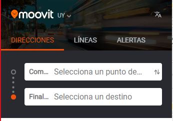

# Carbajal-Suarez-Osano-Barale

* Repositorio dedicado al obligatorio de Ingeniería de Software Ágil 1.

# Indice
1. [Definición del Marco de Trabajo.](#id1)
2. [Planificacion de las Iteraciones.](#id2)
3. [ Inspeccion y adaptacion del proceso](#id3)
4. [Seguimiento de las Iteraciones](#id4)
5. [Repositorio del proyecto](#id5)
6. [Definicion del problema solucion](#id6)
7. [Encuesta para Requerimientos](#id7)
8. [Identificación del problema a resolver](#id8)
9. [Prototipos con posibles Soluciones](#id9)
10. [Ispeccion y Adaptacion del Producto](#id10)

# Definición del Marco de Trabajo 

## Scrum

Definimos usar Scrum por ser un buen marco de trabajo colaborativo entre equipos.

Scrum nos permite priorizar los módulos que aportan mayor valor al negocio y a la organización de una manera iterativa, recibiendo constantemente una retroalimentación de parte del equipo y del product owner.

Este marco de trabajo nos permite organizarnos de una mejor forma utilizando iteraciones a lo largo del proyecto las cuales tienen una duración de 2 semanas. Esto permite al equipo enfocarse durante la iteración en las tareas definidas en la misma.

Scrum nos permite trabajar de una forma mas unida y organizada generando retroalimentación de una manera constante al realizar reuniones diarias entre los miembros del equipo y reuniones con el product owner obteniendo un feedback sobre el trabajo realizado.

## Sprint planing

Al comienzo de cada sprint definimos que tareas hacer para la iteración.

Estas tareas fueron discutidas una vez que estuvo bien definido el backlog.

Al realizar el sprint planning al comienzo de la iteración, ganamos que cada miembro del equipo sepa y tenga en cuenta las tareas relevantes a realizar en dicha iteración.

## Daily Scrum

Esta es una reunión diaria del equipo que se usa en este marco de trabajo.

Por diferencia de horario y por no tener avances todos los días decidimos estar comunicados por mensajes y juntarnos cuando sea necesario.

Lo que ganamos es que todos participemos de la reunión, ya que si se realiza en otro formato no es garantía de que todos los miembros del equipo estén presentes.

## Sprint Review

Al finalizar cada sprint vamos a realizar esta reunión para identificar aspectos positivos y negativos sobre el trabajo realizado. En este tipo de reunión se estudia cual es la situación junto al product owner y en base a eso se actualiza el product backlog con las nuevas condiciones.

Lo que ganamos en dicha reunión es no cometer los mismos errores de iteraciones pasadas y volver a organizar futuras iteraciones.

## Retrospectiva

Esta reunión se hace después del Sprint Review y el objetivo es reflexionar sobre el ultimo sprint e identificar posibles mejores para el próximo.

## Roles

### Scrum Master

Lucas Suarez.

Por su experiencia como profesor particular de matemáticas, Lucas tiene la habilidad de comunicarse y explicarse de forma correcta pudiendo así llevar a cabo la capacitación a los miembros del equipo.

Es una persona organizada, por ende, puede llevar a cabo las reuniones rápidas diarias, preguntando a cada uno cuando disponen del tiempo para hacerlas y buscar el mejor momento para ellas.

Es proactivo, lo cual es necesario para eliminar todos los posibles obstáculos que los Developers y el producto owner tangan.

### Product Owner

Ignacio Carbajal.

Por la simpleza y facilidad para explicarse, la forma en que escuchar e interpretar lo que otros dicen, hacen que Ignacio pueda desempeñar este rol de forma correcta ya que se necesita de alguien que escuche las ideas del cliente y se las traspase al equipo de trabajo.

Es organizado y meticuloso, por lo que tendrá facilidad para organizar las tareas del producto backlog con la prioridad que merezcan. Además de poder gestionar todo el tiempo de vida del producto, supervisando paso por paso para que todo salga de la mejor manera posible y como lo definido en el backlog.

### Development Team

Agustin Barale y Felipe Osano.

Se tomó la decisión de elegir a Felipe y Agustín como los Developers del equipo debido a la experiencia que ambos manejan ya que trabajan en el área del desarrollo de Software.

Son creativos, algo necesario para poder plasmar lo que el producto backlog exige.

Saben trabajar en equipo, se adaptan a los cambios y gestionan bien el tiempo.

## Definition of Ready

Identificación del problema a resolver:

* A quien está orientado nuestro producto

* Que desea cada uno de ellos

* Saber cuales son nuestros competidores y en qué área estamos compitiendo

Definición del problema solución:

* Conocer el producto

Encuesta para Requerimientos:

* Tener definido nuestros consumidores

* La forma en la que se ejecutara la encuesta (presencial, Google forms, etc)

* Si es viable la encuesta para recaudar la información que necesitamos

## Definition of Done

Identificación del problema a resolver:

* Si es viable la encuesta para recaudar la información que necesitamos

* Reconocer de forma correcta a que consumidores estamos apuntando.

* Filtrar la lista de funcionalidades de forma que queden priorizadas, si alguna de las tareas del sprint backlog no llego a realizarse, que la misma vuelva al producto backlog y se tenga en cuenta para el siguiente sprint.

Definición del problema solución:

* Cuando todo el equipo entendió de forma correcta lo que se tenia que hacer, siguiendo se había acordado por el producto owner y el scrum master, dentro del producto backlog
  
Atribuos de Calidad

* Para poder escalar a la mayor cantidad de usuarios posibles, nuestra solución sería colocar la aplicación en las plataformas de descargas digitales más conocidas por todos (appStore y GooglePlay).

* Para que nuestra aplicación pueda ser utilizada por las distintas franjas etarias de la población, decidimos utilizar un diseño con botones y textos grandes para que las personas con dificultades visuales puedan utilizarse sin inconvenientes.

* Para las personas con discapacidades visuales, nuestra aplicación contará con un botón cuya función sería que mediante un comando de voz te vaya guiando con las distintas capas de nuestra aplicación.

* Para poder esconder los datos sensibles, contamos con un inicio de sesión cuya funcionalidad sería poner una capa de seguridad para acceder a dichos datos.

## Encuesta para Requerimientos:

* Cuando se alcanzó a una cantidad esperada de encuestados

* Se recaudo la suficiente información para poder analizar las respuestas

# Planificacion de las Iteraciones 
## Objeto Principal de cada Iteracion

### Iteracion 1

Para esta iteración no se pensó en un sprint backlog pensando en el cliente, sino en nosotros. Con esto me refiero que entendimos bien como funciona y se implementa la metodología ágil Scrum, creamos el repositorio en el cual vamos a trabajar, con sus respectivas estrategias de branching, etc.

Sumando esto se pensó bien el product backlog, el armado del story map con sus respectivas conclusiones al respecto.

### Iteracion 2 

* Arreglar bugs o errores de la Iteracion 1
* Creacion de prototipos
* Estimar la velocidad del equipo en cada tarea
  
### Iteracion 3 

En esta iteración vamos a seguir con los prototipos interactivos para el cliente, además de analizar el feedback de cada uno y llevar a cabo los cambios necesarios.
En esta iteración vamos a cambiar y mejorar errores de la iteración 2.

## Sprint Backlog

### Iteracion 01

Para esta iteración no se pensó en un sprint backlog pensando en el cliente, sino en nosotros. Con esto me refiero que entendimos bien como funciona y se implementa la metodología ágil Scrum, creamos el repositorio en el cual vamos a trabajar, con sus respectivas estrategias de branching, etc.

Sumando esto se pensó bien el product backlog, el armado del story map con sus respectivas conclusiones al respecto.

### Iteracion 02

### Iteracion 03

## Story Map

Para ver el story maps de cada iteracion de forma detalla, ingresar a la carpeta "EvidenciaDocumentacion/StoryMap" 

## Calculo de la velocidad del equipo

### Iteracion 01

Al no tener definido un sprint planning, para esta iteración no se realizó el cálculo de la velocidad del equipo.

### Iteracion 02

**Nomenclatura :** Stoty point (id de la user story)

1) **Total de puntos completados** = 3(133)+3(140)+3(132)+5(144)+3(134)+5(89)+93(3)+3(141) = 28

2) **Total de jornadas reales:**

    (Son 4 iteraciones de 2 semanas cada una: 14 dias)

    **Jornadas Ideales** = 14 +14 + 14 + 14 = 56 

    **Jornadas Reales** = 10 + 10 + 8 +8 = 36

    **Jornadas Peor Caso** = 1 + 1 + 1 + 1 = 4

3) **Calculo de la Velocidad**
   
   * La velocidad es la división de los puntos completados y de las jornadas reales
* 

    V = 28 / 36 → V = 0,7 = 70 % 

### Iteracion 03

**Nomenclatura :** Stoty point (id de la user story)

1) **Total de puntos completados** = 3(90) + 3(91) +3(92) + 3(93) + 8(94) + 3(95) + 5(96) + 5(97) + 8(99) + 5(146) + 5(158) = 51

2) **Total de jornadas reales:**

    (Son 4 iteraciones de 2 semanas cada una: 14 dias)

    **Jornadas Ideales** = 14 +14 + 14 + 14 = 56 

    **Jornadas Reales** = 12 + 12 + 10 + 10 = 44 

    **Jornadas Peor Caso** = 1 + 1 + 1 + 1 = 4

3) **Calculo de la Velocidad**
   
   * La velocidad es la división de los puntos completados y de las jornadas reales
* 

    V = 51 / 44 → V = 1,15 = 115 % 

#  Inspeccion y adaptacion del proceso 

## Retrospectiva

###  Iteracion 1

* No marcamos las horas trabajadas de cada integrante para cada tarea, solo marcamos quien las realizo y cuando se fnalizaron. Sabemos que es una mala practica pero sera implementado para la siguiente iteracion.

* Debemos de organizar mejor los tiempos de trabajo, ya que para que esta entrega tuvimos que dejar cosas sin hacer por falta de tiempo.

* No cumplimos con las reuniones necesarias.

* No mostramos de forma correcta el desarrollo del Product Blacklog ni del Sprint Backlog.

### Iteracion 2 

Para que no sobrecargar esta documentacion, la evidencia de la retrospectiva se encuentra en una caepta aparte. Esta se puede encontrar en la carepata llamada "EvidenciaDocumentacion" dentro de la sub carpeta "Retrospectiva".

## Action Item 

### Iteracion 02

### Iteracion 3

* Utilizar más el grupo de Teams con la profesora por cualquier inquietud o duda que tengamos.

* Concurrir más a las ayudantías

* Tratar de juntarnos los 4 miembros del equipo todos los días, aunque sea poco tiempo 
  
## Medicion Acions Item  

### Iteracion 02

1- Pudimos organizar mejor el trabajo, realizando sesiones personales donde cada uno trabaja en sus task asignadas y luego las discutimos en conjunto en las dailys.

2- Recurrimos a grabaciones de clases anteriores para resolver dudas, si no podíamos con eso recién ahí buscábamos en internet.

3- Hicimos un google calendar todos juntos con los horarios de los integrantes del equipo para poder organizar mejor las sesiones.

4-  Todos pusimos recordatorios en nuestros celulares para marcar las horas de trabajo.

# Seguimiento de las Iteraciones <a name="id4">

## Daily Scrum

### Segunda Iteracion

#### Daily 1

*Lucas:* 

En los días previos a esta daily empecé con mi tarea asignada que fue agregar la información faltante de la iteración 1.
 
Como esta tarea era mejorar el formato o la justificación de algunos puntos, no tuve ningún inconveniente al realizar la misma.
 
Los días siguientes a esta daily voy a seguir con mi tarea asignada.

*Ignacio:*

En estos días estuve estudiando la herramienta a usar para hacer los prototipos, por lo que estuve buscando la mejor opción me parece Frammer, es gratis y tiene bastante información para investigar.
En estos días voy a ver como usar bien la herramienta así podemos empezar a usarla y hacer prototipos.
Estuve trancado en los primeros pasos con Frammer pero con ayuda del equipo lo pudimos sacar adelante.

*Agustin:*

Como mi tarea era comparar los bocetos realizados por mis compañeros, primero tuve que esperar a que ellos completaran dicha tarea. Una vez que esto ocurrió, elegí por el que más se adapta a lo pensado previamente.

Como esta no es una tarea que lleve mucho pienso, no tuve ninguna dificultad que me impidiera avanzar de manera correcta.

*Felipe:* 

En los días previos comencé a realizar la encuesta, organizar las preguntas a hacer y en donde y como hacerla. Tome la decisión de hacerlo en google forms porque es más sencillo de compartir y analizar los datos obtenidos.
En estos días voy a seguir con las preguntas para poder terminarla.
No me tranque en nada en esta tarea.

##### Daily 2

*Lucas:* 

Para esta segunda daily, como ya tenía todo encaminado, les mostré a mis compañeros los cambios realizados para obtener su aprobación.

Una vez obtenida, hice el correspondiente pull request.

*Ignacio:*

En estos días arregle el formato de la entrega con las correcciones que nos dio la profesora, que básicamente fue sacar el formato de carpetas y llevar todo a un readme. También termine de estudiar la herramienta Frammer.
Ahora estoy trancado ya que estoy esperando a que se recauden los suficientes datos en la encuesta para así poder analizarlos.
En estos días voy a estar analizando los datos de la encuesta para asi poder terminar con esa parte. 

*Agustin:*

Una vez realizado los bocetos con su respectivo análisis, se discutio en el grupo si eran los más adecuados para posteriormente hacer los prototipos.

*Felipe:* 

Como ya había terminado mis tareas lo que hice fue mostrar mis cambios y avances a mi compañeros para así tener su feedback.
Gracias a ese feedback cambie ciertas preguntas de la encuesta.

### Tercera Iteracion

#### Daily 1 

*Lucas:*

Estuve arreglando los probelmas de la iteracion pasada. Avnace con las tareas asignadas para dicha user story.

*Ignacio:*

Arregle los errores cometidos en la segunda iteracion, no tuve ningun incoveninte con dichas tareas. En los dias posteriores seguire con esto.

*Agustín:*

Hice parte de mis prototipos asignados, me comunique con Felipe para corroborar estilos de ciertas vistas de la app. En estos días tengo pensado seguir con esto. Estuve trancado con un prototipo pero ya resolví el conflicto.

*Felipe:*

Adelante con mis prototipos, ayude a Agustin con problemas que tuvo además estuve investigando sobre formas de hacer la app más inclusiva para personas ciegas. En estos días tengo pensado terminar con mis prototipos

#### Daily 2

*Lucas:*

Termine de hacer mi parte de las tareas de la correcion de errores.

*Ignacio:*

Termine de hacer las tareas asignadas para esta iteracion..

*Agustín y Felipe:*

Hicimos todos los prototipos pedidos.

## BurdownChart

### Iteracion03

## Registro de Horas

Para que no sobrecargar esta documentacion, la evidencia del registro de horas de cada participante se encuentra en una caepta aparte. Esta se puede encontrar en la carepata llamada "EvidenciaDocumentacion" dentro de la sub carpeta "RegistroHoras".

En esta segunda iteracion tuvimos incovenientes en marcar las horas, por lo tanto van a aparecer tareas sin sus respectivas horas.

### Iteracion 02

| Persona             | Horas | Actividades Realizadas (Id de la task)|
| ------------------- | ----- |---------------------------------------|
| Lucas               | 3.16  | #50                                   |
| Ignacio             | 4.10  | #43, #49, #59                         |
| Felipe              | 3.21  | #40                                   |
| Agustin             | 1.52  | #39, #55, #57                         |

### Iteracion 03

| Persona             | Horas | Actividades Realizadas (Id de la task)|
| ------------------- | ----- |---------------------------------------|
| Lucas               | 2:28  |  #149, #150, # 151                    |
| Ignacio             | 4:59  |  #147, #148, #166                     |
| Felipe              | 4.15  |  #116, #113, #119, #127, #162         |
| Agustin             | 3.48  |  #112, #118, #123, #160               |

Dentro de la carpeta EvidenciaDocumentacion/RegistroHoras/Iteracion03 pueden encontrar sub carpetas con el nombre de cada integrante del equipo. Dentro de dichas carpetas encontraran un PDF por cada integrante que el mismo contiene las horas marcadas con la herramienta Toggl y las horas marcadas en Azure Devops con sus respectivas estimaciones.
  
## Retros

#  Repositorio del proyecto <a name="id5">

Para que no sobrecargar esta documentacion, la evidencia de los commit de cada participante se encuentra en una caepta aparte. Esta se puede encontrar en la carepata llamada "EvidenciaDocumentacion" dentro de la sub carpeta "CapturasCommit".

## Estrategia de Branching

Para tener una mejor organización, creamos 4 ramas, una para cada iteración. Además de estas está la rama principal, la rama main, dicha rama va a tener todos los cambios actualizados a la hora de finalizar cada iteración. Dichas actualizaciones serán a través de los pull request.

Las ramas de las iteraciones, se irán borrando a medida que la iteración haya finalizado.

# Definicion del problema solucion<a name="id6">

## Product Backlog 

Para que no sobrecargar esta documentacion, la evidencia del product backlog se encuentra en una caepta aparte. Esta se puede encontrar en la carepata llamada "EvidenciaDocumentacion" dentro de la sub carpeta "ProductBacklog".

## Funcionalidades a reliazar en la Aplicacion 
- Registrar nuevo usuario

- Login de usuario

- Restaurar contraseña

- Editar usuario

- Buscar líneas de ómnibus utilizando filtros

- Filtro por origen y destino

- Filtro por parada

- Filtro por hora y fecha

- Filtro por línea

- Filtro por ómnibus de discapacitado

- Listado de las líneas más cercanas al usuario con información del destino/origen/tiempo estimado, con la información de cantidad de pasajeros en las mismas.

- Modo viaje. El usuario debe poder seguir el trayecto de la línea de ómnibus a la que se subió, pudiendo saber en qué parte del recorrido se encuentra, cuáles son las paradas hasta el próximo destino e información del destino.
  
- Pagar boleto desde la app

- Modo para personas no videntes

 Notificaciones:

- La línea seleccionada está por llegar a la parada de ómnibus.

- La siguiente parada es tu destino.

- Tu línea frecuente llega en X minutos (dependiendo de la distancia del usuario a la parada) a tu parada habitual.

- La línea seleccionada tiene un retraso y demorará en llegar a tu parada origen.

- La línea seleccionada tiene un desvío.

- Que te avise cuando va a existir un cambio de recorrido por una circunstancia externa.

Compartir mi viaje con otro usuario (se comparte el viaje con otro usuario para que vea el recorrido del ómnibus en tiempo real)

 Historias de los últimos viajes (líneas de ómnibus utilizadas).

## Historias de Usuario

**Registrar nuevo usuario:**

**Como** usuario **quiero** ingresar mis credenciales **para** poder registrarme

**Login de usuario:**

**Como** usuario **quiero** ingresar mis datos **para** poder acceder a la aplicación

**Restaurar contraseña:**

**Como** usuario **quiero** escribir mi mail **para** poder restaurar mi contraseña a través del mail otorgado

**Editar usuario:**

**Como** usuario **quiero** escribir nuevamente mis datos **para** poder actualizar los mismos

**Buscar línea de ómnibus utilizando filtros (aplicado para todos los filtros):**

**Como** usuario **quiero** ingresar diferentes tipos de filtros **para** así poder ver las líneas de ómnibus que necesito

**Listado de las líneas más cercanas al usuario con información del destino/origen/tiempo estimado, con la información de cantidad de pasajeros en las mismas.**

**Como** usuario **quiero** poder seleccionar una funcionalidad de la aplicación **para** que esta me liste las líneas mas cercanas a mí, con toda la información necesaria.

**Modo viaje. El usuario debe poder seguir el trayecto de la línea de ómnibus a la que se subió, pudiendo saber en qué parte del recorrido se encuentra, cuáles son las paradas hasta el próximo destino e información del destino.**

**Como** usuario **quiero** poder seleccionar una funcionalidad de la aplicación **para** poder ver en tiempo real el recorrido del ómnibus pudiendo así ver cuales son las paradas próximas a el.

**Notificaciones: (aplicado a todas las notificaciones)**

**Como** usuario **quiero** que la aplicación me notifique **para** poder mantenerme al tanto en todo momento de las novedades del transporte y a la línea a la cual estoy abordando.

**Compartir mi viaje con otro usuario (se comparte el viaje con otro usuario para que vea el recorrido del ómnibus en tiempo real)**

**Como** usuario **quiero** que pueda compartir mi viaje **para** poder sincronizar mi viaje con otros usuarios de la aplicacion o para mostrar informacion del mismo.

**Historial de los últimos viajes (líneas de ómnibus utilizadas).**

**Como** usuario **quiero** que la aplicacion tenga una opcion **para** poder ver el historial de viajes

## Criterios de aceptación

**Registrar nuevo usuario**

**Dado** un nuevo usuario, **cuando** este se registra **entonces** se le manda un mail de confirmación de registro para que inicie sesión.

**Login de usuario**

**Dado** un usuario registrado, **cuando** este ingresa sus datos **entonces** inicia sesión y es enviado a la página principal

**Restaurar contraseña**

**Dado** un usuario registrado, **cuando** ingresa su email **entonces** se ke manda un mail de recuperación de contraseña

**Editar usuario**

**Dado** un usuario registrado, **cuando** este cambia sus datos **entonces** se actualiza su información

**Buscar líneas de ómnibus utilizando filtros**

**Dado** un usuario, **cuando** utiliza un filtro **entonces** se muestran los datos filtrados

-  **Filtro por origen y destino**

-  **Filtro por parada**

-  **Filtro por hora y fecha**

-  **Filtro por línea**

-  **Filtro por ómnibus de discapacitado**

**Listado de las líneas más cercanas al usuario con información del destino/origen/tiempo estimado, con la información de cantidad de pasajeros en las mismas.**

**Dado** un usuario,**cuando** este lista las líneas mas cercanas, **entonces** se muestran las lineas mas cercanas y la información de cantidad de pasajeros en las mismas

**Modo viaje. El usuario debe poder seguir el trayecto de la línea de ómnibus a la que se subió, pudiendo saber en qué parte del recorrido se encuentra, cuáles son las paradas hasta el próximo destino e información del destino.**

**Dado** un usuario, **cuando** este activa el modo viaje **entonces** se le muestra el trayecto de la linea a la que se subió.

**Notificaciones:**

**Dado** un usuario **cuando** este tiene instalada la aplicación y tiene activadas las notificaciones **entonces** recibe notificaciones de la aplicación

-  **La línea seleccionada está por llegar a la parada de ómnibus.**

-  **La siguiente parada es tu destino.**

-  **Tu línea frecuente llega en X minutos (dependiendo de la distancia del usuario a la parada) a tu parada habitual.**

-  **La línea seleccionada tiene un retraso y demorará en llegar a tu parada origen.**

-  **La línea seleccionada tiene un desvío.**

-  **Que te avise cuando va a existir un cambio de recorrido por una circunstancia externa.**

**Compartir mi viaje con otro usuario (se comparte el viaje con otro usuario para que vea el recorrido del ómnibus en tiempo real)**

**Dado** un usuario **cuando** comparte un viaje **entonces** se genera un enlace para poder compartir el viaje con otros usuarios

**Historial de los últimos viajes (líneas de ómnibus utilizadas).**

**Dado** un usuario **cuando** este accede al historial de viajes **entonces** se le muestran sus ultimos viajes realizados

## Propuesta de valor.

**Yenderson: ayudándote a recorrer el país.**

**Titular:** ayudándote a recorrer el país.
Subtitulo-párrafo: damos toda la información necesaria del transporte publico por lo tanto ayudamos a los que recurren a los servicios de transporte como a los que lo manejan.

**Elemento visual:**

**Perfil del cliente de Yenderson:**

**Trabajos de clientes:**
Los clientes de Yenderson desean obtener toda la información necesaria sobre su viaje en transporte publico

**Ganancias:**
Los clientes quieren una forma sencilla y practica de obtener esa información para así hacer su viaje más ameno.

**Dolores:**
Las personas con discapacidades visuales no se sentirán cómodos con la aplicación.

**Mapa de valor para Yenderson:**

**Generador de ganancias:**
Los clientes pueden confiar en que nuestra fuente de información es verídica, por lo tanto, puede organizar sus horarios de forma segura ya que su transporte va a cumplir con el horario marcado.

**Analgésicos:**
Vamos a hacer una aplicación que sea enfocada con personas con este tipo de discapacidad

**Productos y servicios:**
Vamos a poner un botón en la esquina superior derecha de la pantalla para que la aplicación le avise al usuario lo que está en pantalla mediante comando de voz. De esta forma la persona puede usar la aplicación.

# Encuesta para Requerimientos<a name="id7">

Viendo las respuestas podemos afirmar lo que suponíamos, que la edad promedio a la que están enfocadas este tipo de aplicaciones es la de un publico joven, el cual hace uso de aplicaciones de transporte para obtener información sobre el mismo.
A grandes rasgos la encuesta fue beneficiosa, pudiendo reafirmar suposiciones que manejábamos en el equipo. De esta forma estamos seguros de lo que quiere nuestro publico y el valor característico que le podemos dar a nuestra aplicación.

Comentario: Si desean podemos invitarlas a la encuesta para que puedan validar la veracidad de los datos obtenidos.

Link de la encuesta: https://forms.gle/jxA5P3j2d6FK1e956

# Identificación del problema a resolver <a name="id8">

## Identificación de interesados

Vamos a tener interesados con diferentes propósitos.. Los interesados en el proyecto son personas y organizaciones que están activamente involucrados en el proyecto , o cuyos intereses pueden verse afectados de manera positiva o negativa por la ejecución o terminación del proyecto.

A continuación pasamos a detallar los distintos interesados que fuimos identificando a lo largo de la iteración:

**Compañías de transporte:** Son empresas de transporte que operan en Montevideo, las cuales contienen la mayoría de las líneas de recorrido en Montevideo. Son interesados porque el uso de la aplicación es una mejora al servicio de dichas empresas, además ellos nos aportan los horarios de los recorridos de las líneas de transporte, sabiendo así los horarios del mismo. Algunos ejemplos son: CUTCSA, COME, COETC, UCOT.

Dentro de las líneas de colectivos podemos identificar varios roles de subinteresados, éstos pueden ser tanto los choferes, los guardas o los inspectores, ya que el uso de la aplicación facilita sus trabajos.

**Pasajeros:** Es el principal interesado, ya que va a ser quien va a usar la mayoría de las funcionalidades ofrecidas por la aplicación.

**Google:** Es la compañía que nos va a brindar los mapas necesarios para el funcionamiento de la aplicación.

**Plataformas de descargas de aplicaciones:** Es donde los usuarios podrán conseguir la aplicación. Como por ejemplo: Play Store, AppStore, etc.

**Intendencia de Montevideo:** Presta el servicio de la tarjeta STM.

## Lista de funcionalidades por interesado

**Compañías de transporte:** Estadísticas sobre concurrencia en los ómnibus en distintos horarios y zonas.

Dentro de la compañía de transporte como ya identificamos, tenemos gente que trabaja para la misma, entonces va a utilizar la aplicación para facilitar sus tareas dentro de la empresa.

- Choferes: Pueden usar la aplicación para ser notificados sobre cambios de rutas, o como guía para inexpertos.

- Inspectores: Pueden usar la aplicación para agilizar sus tareas diarias dentro y fuera de los ómnibus, como controlar a los pasajeros y los horarios de los ómnibus.

**Pasajeros**:

- Buscar líneas de ómnibus utilizando filtros.

- Listado de las líneas mas cercanas al usuario con información del origen, destino y tiempo estimado.

- Cantidad de pasajeros en una unidad.

- Modo viaje: El usuario puede seguir el trayecto de la línea a la que se subió, sabiendo en tiempo real donde se encuentra y cuales son las siguientes paradas hasta su destino.
- Notificaciones:

- El ómnibus está por llegar a la parada de origen

- El ómnibus está por llegar a la parada de destino

- Tu línea frecuente llega en x minutos

- El ómnibus tiene un retraso y tardará en llegar a la parada

- La línea seleccionada tiene un desvío

- Compartir mi viaje con otro usuario.

- Historial de los últimos viajes.

- Modo no vidente.

- Modo daltónico.

**Google:**

En éste caso nosotros no le vamos a brindar un servicio a Google, si no, ellos a nosotros. Como sería la de los mapas que utilizaremos en la aplicación.

También vamos a contar con el inicio de sesión con la cuenta de Google, utilizando OAuth.

**Plataformas de descargas de aplicaciones:** Son los intermediarios entre la aplicación y el usuario, ya que nos ofrecen un lugar donde los clientes pueden descargar la aplicación.

**Intendencia de Montevideo:** Nos brinda la posibilidad de tener una boletera virtual, en lugar de utilizar la tarjeta STM.

## Estudio de Competidores

A continuación vamos a detallar el estudio de las competencias, comentando los puntos a favor y en contra que encontramos.

### Moovit

#### Estudio Funcionalidades

*  Tiene un filtro de paradas por origen y destino
*  Tiene un filtrado por lineas de omnibus
*  Tiene para guardar lugares o paradas favoritas
*  Podemos pedir transporte privado (uber, cabify,etc)
*  Tiene alertas/ notificaciones
* Podes cambiar el idioma de la aplicación
*  Podes utilizarla tanto en android como en iphone
*  Podes iniciar sesión para acceder a determinadas funcionalidades
  
#### Cosas a Favor

* Poder guardar los lugares favoritos a los que concurre

* Notificación de actualizaciones tanto en la aplicación, como así también en los recorridos

* Siguiendo con el primer punto, también se puede guardar las paradas y las líneas favoritas

#### Cosas en Contra

* Existe una versión paga, en la cual las publicidades no existen

* No tiene un horario en tiempo real que podemos verificar por donde se encuentra la línea

### Cómo ir

#### Estudio de Funcionalidades

* Tiene distintos tipo de filtro, tanto como esquina o direccion, lugares de interés como otro, para hacer la búsqueda más precisa.
  
* Tiene un mapa el cual podemos poner la ubicación exacta a la que queremos ir.
  
* Se puede utilizar tanto en android como en iphone
  
* Tiene una bandeja de notificaciones
  
* Podes configurar la aplicación

#### Cosas a Favor

* Podemos verificar por donde se encuentra nuestra linea, ya que existe la opcion de ver el recorrido en tiempo real independientemente de la empresa en la cual se quiere viajar

* Muestra las líneas que cuentan con lugares para discapacitados

* No contiene una versión paga

#### Cosas En Contra

* Mala optimización lo que genera tener que reiniciarla

* No contiene un historial de viajes. Lo que implica tener que volver a ingresar los datos de viajes frecuentes

* Funcionalidades no útiles

### STM Montevideo

#### Estudio de Funcionalidades

* Tiene un mapa
  
* Podes filtrar por paradas y por líneas
  
* Deja filtrar por domingos y feriados

#### Cosas a Favor

* Contiene un diseño simple pero funcional

* No contiene una versión paga

#### Cosas en Contra

* Parece una versión en la cual no pasó por múltiples etapas de testing. Por lo tanto tiene varios errores de diseño.

### Cutcsa

#### Estudio de Funcionalidades

* Tiene un mapa que puedes filtrar por paradas
  
* Tenes tus favoritos, horarios y recorridos guardados en un historial
  
* Tenes un chat online para hacer consultas

#### Cosas a Favor

* Diseño simple en la sección principal

* Información en tiempo real sobre las líneas que viene en camino

#### Cosas en Contra

* Funcionalidades extras que no están a la vista y no se especifica su uso

* Algunas funciones están ocultas y mal implementadas

* Solamente podes ver la ubicación en tiempo real de los ómnibus de la empresa Cutcsa.

# Prototipos con posibles Soluciones<a name="id9">

## Bocetos Previos

Este boceto fue pensado entre los 4 integrantes del equipo antes de realizar el prototipo final.

## Prototipos

## Programa utilizado para prototipar

Framer es una de las herramientas de creación de prototipos de aplicaciones más potentes del mercado. Se puede usar para diseñar cualquier dispositivo móvil, desde iOS a Android. Si conoces un poco de programación, sus capacidades son virtualmente ilimitadas porque está basada en CoffeeScript — un lenguaje de programación relativamente fácil. Un diseñador solo estaría limitado por su imaginación y habilidades de codificación.

Link : https://www.framer.com/

## Acceso a la Aplicacion

Para poder acceder a la aplicacion de manera dinamica, pueden acceder al siguente link.

Link: https://standards-rob-722613.framer.app 
## Capturas de Prototipos

Para no llenar el documento con imagenes, las capturas de todos los prototipos se encuentran en la carpeta : EvidenciaDocumentacion/Prototipos

# Ispeccion y Adaptacion del Producto<a name="id10">
